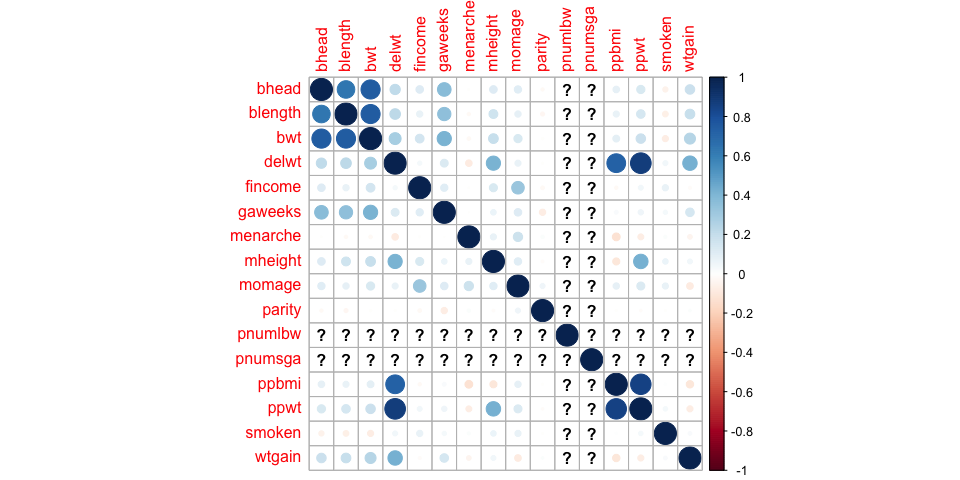
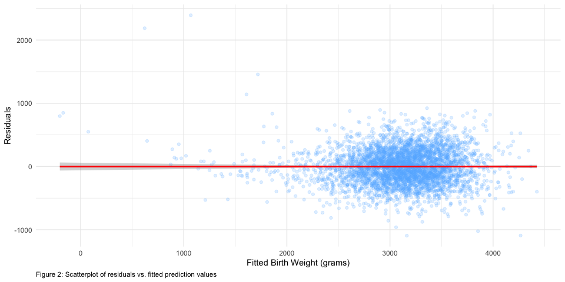
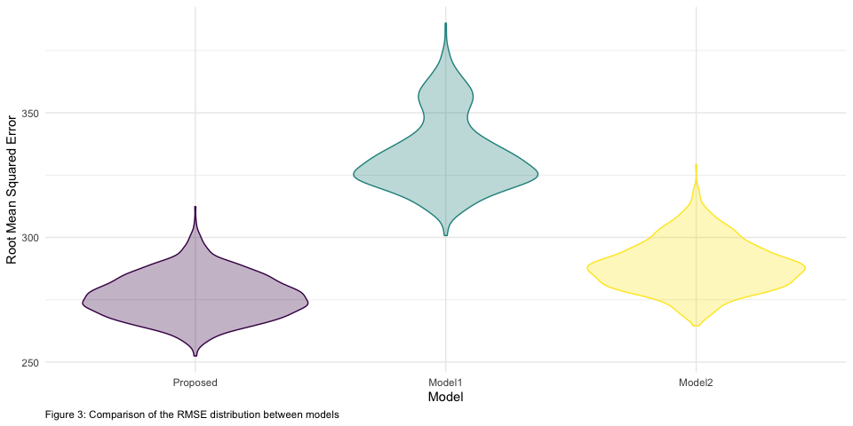
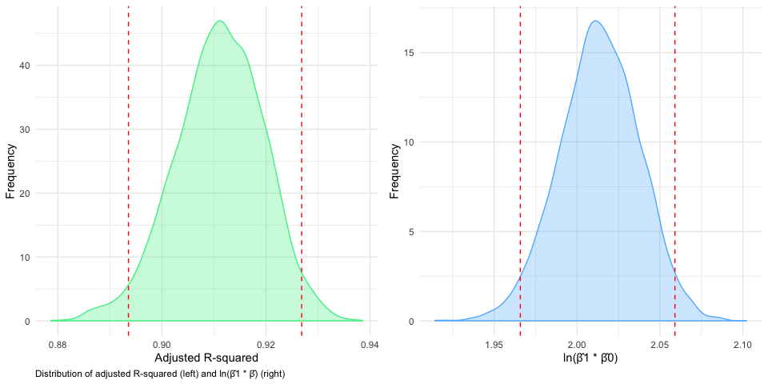

P8105 Data Science I - Homework 6
================
Kevin S.W. UNI: ksw2137
11/22/2019

# Problem 1 - Birth Weight Modelling

First load our birthweight
data.

``` r
# though this part doesn't require seed, will set here because further problem requires it.
set.seed(2)

# reading in source data
birthweight_df <- read_csv("./data/Birthweight.csv") %>% 
  janitor::clean_names() %>% 
  mutate_at(.vars = vars("babysex", "malform", # convert columns in vars() to factors
                         "mrace", "frace"
                         ),   
            .funs = funs(factor)) %>% 
  mutate(
    babysex = fct_recode(babysex, male = "1", female = "2"),
    malform = fct_recode(malform, absent = "0", present = "1")
    )

#skimr::skim(birthweight_df)                   # remove "#" to activate skimr check 
```

After loading our birthweight data, we obtain a 4342 by 20 dataset that
all started as numeric variables. `babysex`, `malform`, `frace`, `mrace`
were converted to categorical variables as they should.

Variables are:

  - Baby-related:
      - `bwt`: baby’s birth weight (g)
      - `blength`: baby’s length at birth (cm)
      - `bhead`: baby’s head circumference at birth (cm)
      - `babysex`: baby’s sex (male = 1, female = 2)
      - `gaweeks`: gestational age in weeks
      - `malform`: presence of malformations that could affect weight (0
        = absent, 1 = present)
  - Mom-related:
      - `delwt`: mother’s weight at delivery (lbs)
      - `wtgain`: mother’s weight gain during pregnancy (pounds)
      - `ppwt`: mother’s pre-pregnancy weight (pounds)
      - `ppbmi`: mother’s pre-pregnancy BMI
      - `mheigth`: mother’s height (in.)
      - `momage`: mother’s age at delivery (years)
      - `menarche`: mother’s age at menarche (first menstruation; in
        years)
      - `mrace`: mother’s race (1 = White, 2 = Black, 3 = Asian, 4 =
        Puerto Rican, 8 = Other)
      - `parity`: number of live births prior to this pregnancy
      - `pnumlbw`: previous number of low birth weight babies
      - `pnumsga`: number of prior small-for-gestational-age babies
      - `smoken`: average number of cigarettes smoked per day during
        pregnancy
  - Family/father-related:
      - `frace`: father’s race (1 = White, 2 = Black, 3 = Asian, 4 =
        Puerto Rican, 8 = Other, 9 = Unknown)
      - `fincome`: family monthly income (in hundreds, rounded)

`skimr::skim()` reveals no missing variables. However, it reveals some
variables that likely shouldn’t even be considered; `pnumlbw` and
`pnumsga`, though measures numbers of babies, only records `0` in this
dataset.

### Model Proposal

We will attempt to make a model with `bwt` as our outcome of interest.
Given that there are a lot of variables related to each other, there are
likely a lot of correlations. We can then use a correlation matrix to
see which variables are highly correlated and we can pick one out of
those groups.

``` r
# correlation matrix
select_if(birthweight_df, is.numeric) %>%     # select numeric variables
  cor() %>%                                   # get the correlation values
  corrplot()                                  # make the correlation matrix
```



Based on the plot above, we see that variables most correlated to `bwt`
is `bhead`, `blength`, `delwt`, `gaweeks`, `wtgain`, `mheight`, and
`ppwt`. However, we also note that `delwt` is highly correlated with
`ppwt`. Given that `delwt` is more correlated to `bwt`, we’ll keep
`delwt` and drop `ppwt`. It is also slightly correlated to `wtgain`, so
we’ll drop `wtgain` (lower collinearity to `bwt`) to prevent
collinearity. Finally, we would think that `mrace` (mother’s
race/ethnicity) might also influence a baby’s weight (genetically
related). So our proposed model:

  - Proposed model: `bhead`, `blength`, `delwt`, `gaweeks`, and `mrace`;
    main effects only.

<!-- end list -->

``` r
# our first model try
first_fit_lm <- birthweight_df %>% 
  lm(bwt ~ bhead + blength + delwt + gaweeks + mrace, data = .)

# AIC, R-squared, etc
first_fit_lm %>% 
  broom::glance() %>% 
  knitr::kable()
```

| r.squared | adj.r.squared |    sigma | statistic | p.value | df |     logLik |      AIC |     BIC |  deviance | df.residual |
| --------: | ------------: | -------: | --------: | ------: | -: | ---------: | -------: | ------: | --------: | ----------: |
| 0.7091789 |     0.7087091 | 276.4166 |  1509.804 |       0 |  8 | \-30567.36 | 61152.71 | 61210.1 | 331144133 |        4334 |

Using `broom::glance()` shows that our adjusted R-squared is at a pretty
good value of 0.709, which means 70.9% of the variability in `bwt` is
explained by our covariates.

``` r
# statistics of each coefficient
# as well as replacing the label to be more explicit
first_fit_lm %>% 
  broom::tidy() %>% 
  mutate(
    term = str_replace(term, "^mrace", "Mom's Race: "),
    term = str_replace(term, c("1", "2", "3", "4"), c("white", "black", "asian", "puerto rican")),
    p.value = scales::scientific(p.value, digits = 3)
    ) %>% 
  knitr::kable()
```

| term                     |     estimate |  std.error |   statistic | p.value   |
| :----------------------- | -----------: | ---------: | ----------: | :-------- |
| (Intercept)              | \-5870.87387 | 96.9590127 | \-60.550058 | 0.00e+00  |
| bhead                    |    131.72752 |  3.4446534 |   38.241155 | 5.74e-276 |
| blength                  |     77.02530 |  2.0329123 |   37.889139 | 1.33e-271 |
| delwt                    |      2.15978 |  0.1973335 |   10.944819 | 1.61e-27  |
| gaweeks                  |     11.87186 |  1.4671179 |    8.091963 | 7.56e-16  |
| Mom’s Race: black        |  \-126.77233 |  8.9833879 | \-14.111862 | 3.02e-44  |
| Mom’s Race: asian        |   \-51.59923 | 42.7803594 |  \-1.206143 | 2.28e-01  |
| Mom’s Race: puerto rican |  \-102.52002 | 18.8392756 |  \-5.441824 | 5.56e-08  |

We see from our coefficient summary that each variable have a
significant p \< 0.05 except for Asian mothers (White as the reference
race). This appears to be a reasonable compromise.

### Checking assumptions

We then check our normality assumption of our model by plotting
residuals vs. fitted values.

``` r
birthweight_df %>% 
  add_residuals(first_fit_lm) %>%                   # adding residuals to our df
  add_predictions(first_fit_lm) %>%                 # add predictions using our df
  ggplot(aes(x = pred, y = resid)) +
  geom_point(alpha = 0.2, color = "steelblue1") +
  geom_smooth(method = "lm", color = "red") +
  labs(x = "Fitted Birth Weight (grams)",
       y = "Residuals",
       caption = "Figure 2: Scatterplot of residuals vs. fitted prediction values")
```



From the scatterplot, we do notice some upward curve at the lower end of
fitted values likely due to outliers. Or, it could be that our data is
not linear though this is less likely. However, it appears that most of
our points seems to be centered around 0 without much variability. This
means that our assumption of normality still holds.

### Model validation

We can then compare our model to the other two proposed models:

  - Model 1: length at birth, gestational age as predictors (main
    effects only)

<!-- end list -->

``` r
# comparison model 1
model1 <- birthweight_df %>% 
  lm(bwt ~ blength + gaweeks, data = .)
```

  - Model 2: head circumference, length, sex, and all interactions
    (including the three-way interaction) between these

<!-- end list -->

``` r
# comparison model 2
model2 <- birthweight_df %>% 
  lm(bwt ~ bhead * blength * babysex, data = .)
```

We will use cross validation in order to compare our models with these
two by looking for the lowest RMSE as we are trying to evaluate the
effects of various variables on birth weight.

``` r
# splitting our df into the default 80:20 
cv_df <- crossv_mc(birthweight_df, 1000) %>% 
  mutate(                                     # converts the resulting lists into tibbles
    train = map(train, as_tibble),
    test = map(test, as_tibble)
  )


# split process to relief some processing power
# applies model estimation to each dataset with the 3 models
trained_cv_df <- cv_df %>% 
  mutate(
    prop_lm = map(train, ~lm(bwt ~ bhead + blength + delwt + gaweeks + mrace, data = .x)),
    mod1_lm = map(train, ~lm(bwt ~ blength + gaweeks, data = .x)),
    mod2_lm = map(train, ~lm(bwt ~ bhead * blength * babysex, data = .x)))
    
# obtain rmse for each dataset in each model-set
trained_cv_df <- trained_cv_df %>% 
  mutate(
    rmse_Proposed = map2_dbl(prop_lm, test, ~rmse(model = .x, data = .y)),
    rmse_Model1 = map2_dbl(mod1_lm, test, ~rmse(model = .x, data = .y)),
    rmse_Model2 = map2_dbl(mod2_lm, test, ~rmse(model = .x, data = .y))
    )

# plots distribution of rmse by each model
trained_cv_df %>% 
  select(starts_with("rmse")) %>%              # select the rmse columns
  pivot_longer(everything(),
               names_to = "model", 
               values_to = "rmse",
               names_prefix = "rmse_") %>% 
  mutate(model = fct_inorder(model)) %>%       # arrange by model
  ggplot(aes(x = model, y = rmse, color = model, fill = model)) + 
  geom_violin(alpha = 0.3) +
  labs(x = "Model",
       y = "Root Mean Squared Error",
       caption = "Figure 3: Comparison of the RMSE distribution between models") +
  theme(legend.position = "none")
```



Per our plot above, it appears that our proposed model have the lowest
RMSE. Given this result, I would recommend the model that contains
`bhead`, `blength`, `delwt`, `gaweeks`, and `mrace` as main effects
only.

# Problem 2 - Weather Data

In this problem we’ll be using weather data for Central Park, NY in
2017. Code adopted from homework website.

``` r
# loads weather data; code from homework website.
weather_df <- 
  rnoaa::meteo_pull_monitors(
    c("USW00094728"),
    var = c("PRCP", "TMIN", "TMAX"), 
    date_min = "2017-01-01",
    date_max = "2017-12-31") %>%
  mutate(
    name = recode(id, USW00094728 = "CentralPark_NY"),
    tmin = tmin / 10,
    tmax = tmax / 10) %>%
  select(name, id, everything())
```

After loading the data, we should clean it up a bit and only select the
things we need before running a bootstrap and obtaining the r̂-squared
for each resampling as well as
log(beta0\*beta1).

``` r
# selects relevant columns and renames Central Park to cp_ny for simplicity
strapped_weather_df <- weather_df %>% 
  select(name, tmax, tmin) %>% 
  mutate(
    name = str_replace(name, "CentralPark_NY", "cp_ny")
  ) %>% 
  bootstrap(n = 5000) %>%                                 # runs bootstrap x5000
  mutate(
    model = map(strap, ~lm(tmax ~ tmin, data = .x)),      # obtains model for each strap sample
    result = map(model, broom::tidy),                     # obtains estimate data from each model
    stat = map(model, broom::glance)                      # obtains statistics from each model
  )

# a cleaned and filtered df containing variables of interest
clean_weather_strap <- strapped_weather_df %>% 
  select(-model, -strap) %>%                              # removed the original strap sample and model
  rename("strap_run" = .id) %>%                           # renamed id to "run numbers"
  unnest() %>%                                            # unnest the tibbles that remained
  select(strap_run, term, estimate, adj.r.squared) %>%    # selected relevant measures
  mutate(
    term = case_when(term == "(Intercept)" ~ "beta0",     # renamed intercept to beta0
                     term == "tmin" ~ "beta1",            # renamed slope to beta1
                     TRUE ~ as.character(term))
  ) %>% 
  pivot_wider(names_from = term,                          # put the betas into different columns
              values_from = estimate) %>% 
  mutate(
    estimate_log = log(beta0 * beta1)                     # add column for the ln(b0 * b1)
  ) %>% 
  janitor::clean_names()
```

After cleaning and bootstrapping, we isolated only the variables we’re
interested in, which is stored in `clean_weather_strap` that contains
5000 observations for `adj_r_squared`, `beta0`, `beta1`, and
`estimate_log` labeled by `strap_run`. We can check their distribution
using a simple density plot below.

``` r
# density plot of r-squared with 2.5% and 97.5% quantile labeled
r_squared_plot <- clean_weather_strap %>% 
  ggplot(aes(x = adj_r_squared)) +
  geom_density(color = "seagreen2", fill = "seagreen2", alpha = 0.3) +
  geom_vline(xintercept = c(quantile(pull(clean_weather_strap, adj_r_squared), probs = 0.025),
                            quantile(pull(clean_weather_strap, adj_r_squared), probs = 0.975)),
             linetype = "dashed",
             color = "red") +
  labs(x = "Adjusted R-squared",
       y = "Frequency",
       caption = "Distribution of adjusted R-squared (left) and ln(β̂1 * β̂) (right)")

# density plot of ln(beta0 * beta1) with 2.5% and 97.5% quantile labeled
estimate_log_plot <- clean_weather_strap %>% 
  ggplot(aes(x = estimate_log)) +
  geom_density(color = "steelblue1", fill = "steelblue1", alpha = 0.3) +
  geom_vline(xintercept = c(quantile(pull(clean_weather_strap, estimate_log), probs = 0.025),
                            quantile(pull(clean_weather_strap, estimate_log), probs = 0.975)),
             linetype = "dashed",
             color = "red") +
  labs(x = "ln(β̂1 * β̂0)",
       y = "Frequency")

# use patchwork to print them side-by-side
r_squared_plot + estimate_log_plot
```



Plot suggests that both the r-squared and log(beta0 \* beta1) are
normally distributed. However, note that there is a very slight left
skew on the distribution of r-squared, which shouldn’t greatly deviate
from our assumptions of normality. The red, dashed line represents our
2.5% and 97.5% quantile which are obtained using the `quantile()`
function below.

``` r
# r-sq 95% CI
quantile(pull(clean_weather_strap, adj_r_squared), probs = c(0.025, 0.975))
```

    ##      2.5%     97.5% 
    ## 0.8935620 0.9268494

``` r
# est_log 95% CI
quantile(pull(clean_weather_strap, estimate_log), probs = c(0.025, 0.975))
```

    ##     2.5%    97.5% 
    ## 1.965773 2.059037

As such, we have a 95% CI of \[0.893, 0.927\] for adjusted R-squared and
\[1.966, 2.058\] for ln(β̂1 \* β̂0).
