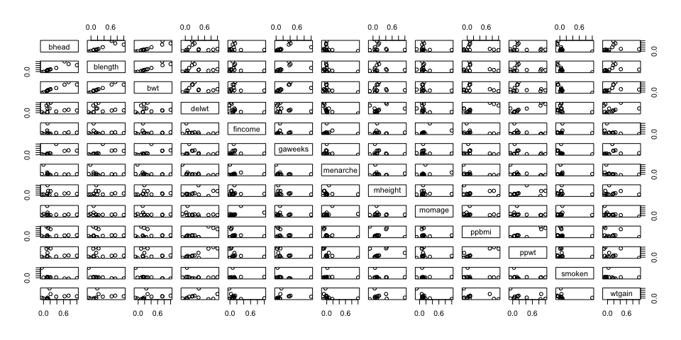
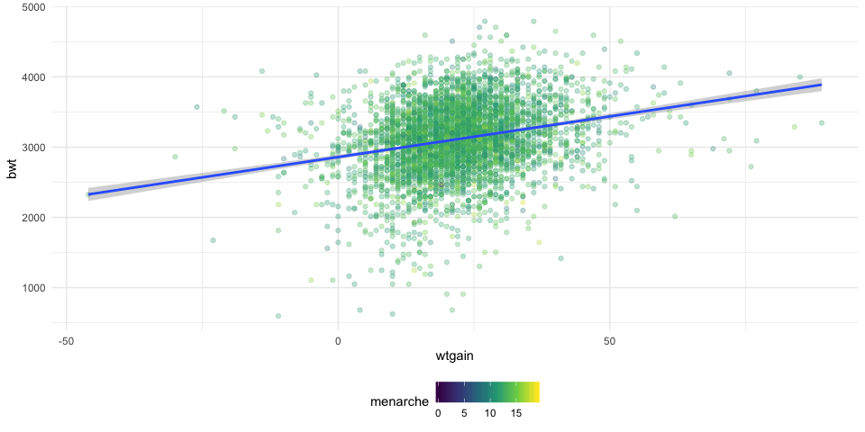

P8105 Data Science I - Homework 6
================
Kevin S.W. UNI: ksw2137
11/19/2019

# Problem 1

First load our birthweight data. With

``` r
birthweight_df <- read_csv("./data/Birthweight.csv") %>% 
  janitor::clean_names() %>% 
  mutate_at(.vars = vars("babysex", "malform", # convert columns in vars() to factors
                         "mrace", "pnumlbw", "pnumsga", "parity",
                         "frace"
                         ),   
            .funs = funs(factor))
```

    ## Parsed with column specification:
    ## cols(
    ##   .default = col_double()
    ## )

    ## See spec(...) for full column specifications.

    ## Warning: funs() is soft deprecated as of dplyr 0.8.0
    ## Please use a list of either functions or lambdas: 
    ## 
    ##   # Simple named list: 
    ##   list(mean = mean, median = median)
    ## 
    ##   # Auto named with `tibble::lst()`: 
    ##   tibble::lst(mean, median)
    ## 
    ##   # Using lambdas
    ##   list(~ mean(., trim = .2), ~ median(., na.rm = TRUE))
    ## This warning is displayed once per session.

``` r
# skimr::skim(birthweight_df)                   # remove "#" to activate skimr check 
```

After loading our birthweight data, we obtain a 4342 by 20 dataset that
all started as numeric variables. `babysex`, `malform`, `frace`, `mrace`
were converted to categorical variables as they should. Count variables
with small number of “groups” are also converted to categoricals. These
are `parity`, `pnumlbw` and `pnumsga`. `skimr::skim()` reveals no
missing variables.

Variables are:

  - Baby-related:
      - `bwt`: baby’s birth weight (g)
      - `blength`: baby’s length at birth (cm)
      - `bhead`: baby’s head circumference at birth (cm)
      - `babysex`: baby’s sex (male = 1, female = 2)
      - `gaweeks`: gestational age in weeks
      - `malform`: presence of malformations that could affect weight (0
        = absent, 1 = present)
  - Mom-related:
      - `delwt`: mother’s weight at delivery (lbs)
      - `wtgain`: mother’s weight gain during pregnancy (pounds)
      - `ppwt`: mother’s pre-pregnancy weight (pounds)
      - `ppbmi`: mother’s pre-pregnancy BMI
      - `mheigth`: mother’s height (in.)
      - `momage`: mother’s age at delivery (years)
      - `menarche`: mother’s age at menarche (first menstruation; in
        years)
      - `mrace`: mother’s race (1 = White, 2 = Black, 3 = Asian, 4 =
        Puerto Rican, 8 = Other)
      - `parity`: number of live births prior to this pregnancy
      - `pnumlbw`: previous number of low birth weight babies
      - `pnumsga`: number of prior small-for-gestational-age babies
      - `smoken`: average number of cigarettes smoked per day during
        pregnancy
  - Family/father-related:
      - `frace`: father’s race (1 = White, 2 = Black, 3 = Asian, 4 =
        Puerto Rican, 8 = Other, 9 = Unknown)
      - `fincome`: family monthly income (in hundreds, rounded)

### Model Proposal

Given that the mother is the one “doing the most work”, it is unlikely
that the father’s race plays a role so `frace` will not be considered.
From the mom-related variables, `menarche` is likely unrelated to birth
as well as `parity`. `bhead` removed as this is likely correlated to
`blength`.

  - bhead removed; as this is likely highly correlated with blength.
    babysex likely minimal effect

  - delwt likely correlated with wtgain but wtgain might be more
    
      - `bwt`: baby’s birth weight (g)
      - `blength`: baby’s length at birth (cm)
      - `gaweeks`: gestational age in weeks
      - `malform`: presence of malformations that could affect weight (0
        = absent, 1 = present)

  - Mom-related:
    
      - `delwt`: mother’s weight at delivery (lbs)
      - `wtgain`: mother’s weight gain during pregnancy (pounds)
      - `ppwt`: mother’s pre-pregnancy weight (pounds)
      - `ppbmi`: mother’s pre-pregnancy BMI
      - `mheigth`: mother’s height (in.)
      - `momage`: mother’s age at delivery (years)
      - `menarche`: mother’s age at menarche (first menstruation; in
        years)
      - `mrace`: mother’s race (1 = White, 2 = Black, 3 = Asian, 4 =
        Puerto Rican, 8 = Other)
      - `parity`: number of live births prior to this pregnancy
      - `pnumlbw`: previous number of low birth weight babies
      - `pnumsga`: number of prior small-for-gestational-age babies
      - `smoken`: average number of cigarettes smoked per day during
        pregnancy

  - Family/father-related:
    
      - `frace`: father’s race (1 = White, 2 = Black, 3 = Asian, 4 =
        Puerto Rican, 8 = Other, 9 = Unknown)
      - `fincome`: family monthly income (in hundreds, rounded)

<!-- end list -->

``` r
# Making correlation plot to test for 
bwt_corr_data <- round(cor(select_if(birthweight_df, is.numeric)), 2) # obtaining correlation data between all variables

pairs(bwt_corr_data)
```



``` r
# proposed model
```

Propose a regression model for birthweight. This model may be based on a
hypothesized structure for the factors that underly birthweight, on a
data-driven model-building process, or a combination of the two.
Describe your modeling process and show a plot of model residuals
against fitted values – use add\_predictions and add\_residuals in
making this plot.

Compare your model to two others:

  - Model 1: length at birth, gestational age as predictors (main
    effects only)

<!-- end list -->

``` r
birthweight_df %>% 
  ggplot(aes(x = wtgain, y = bwt, color = menarche)) +
  geom_point(alpha = 0.3) +
  geom_smooth(method = "lm")
```



``` r
model1 <- birthweight_df %>% 
  lm(bwt ~ blength + gaweeks, data = .)
```

  - Model 2: head circumference, length, sex, and all interactions
    (including the three-way interaction) between these

<!-- end list -->

``` r
model2 <- birthweight_df %>% 
  lm(bwt ~ bhead * blength * babysex, data = .)
```

Make this comparison in terms of the cross-validated prediction error;
use crossv\_mc and functions in purrr as appropriate.

Note that although we expect your model to be reasonable, model building
itself is not a main idea of the course and we don’t necessarily expect
your model to be “optimal”

# Problem 2

In this problem we’ll be using weather data for Central Park, NY in
2017. Code adopted from homework website.

``` r
# loads weather data; code from homework website.
weather_df <- 
  rnoaa::meteo_pull_monitors(
    c("USW00094728"),
    var = c("PRCP", "TMIN", "TMAX"), 
    date_min = "2017-01-01",
    date_max = "2017-12-31") %>%
  mutate(
    name = recode(id, USW00094728 = "CentralPark_NY"),
    tmin = tmin / 10,
    tmax = tmax / 10) %>%
  select(name, id, everything())
```

    ## Registered S3 method overwritten by 'crul':
    ##   method                 from
    ##   as.character.form_file httr

    ## Registered S3 method overwritten by 'hoardr':
    ##   method           from
    ##   print.cache_info httr

    ## file path:          /Users/NetQuarter/Library/Caches/rnoaa/ghcnd/USW00094728.dly

    ## file last updated:  2019-10-01 18:08:12

    ## file min/max dates: 1869-01-01 / 2019-09-30

The boostrap is helpful when you’d like to perform inference for a
parameter / value / summary that doesn’t have an easy-to-write-down
distribution in the usual repeated sampling framework. We’ll focus on a
simple linear regression with tmax as the response and tmin as the
predictor, and are interested in the distribution of two quantities
estimated from these data:

r̂ 2 log(β̂ 0∗β̂ 1) Use 5000 bootstrap samples and, for each bootstrap
sample, produce estimates of these two quantities. Plot the distribution
of your estimates, and describe these in words. Using the 5000 bootstrap
estimates, identify the 2.5% and 97.5% quantiles to provide a 95%
confidence interval for r̂ 2 and log(β̂ 0∗β̂ 1). Note: broom::glance()
is helpful for extracting r̂ 2 from a fitted regression, and
broom::tidy() (with some additional wrangling) should help in computing
log(β̂ 0∗β̂ 1).
