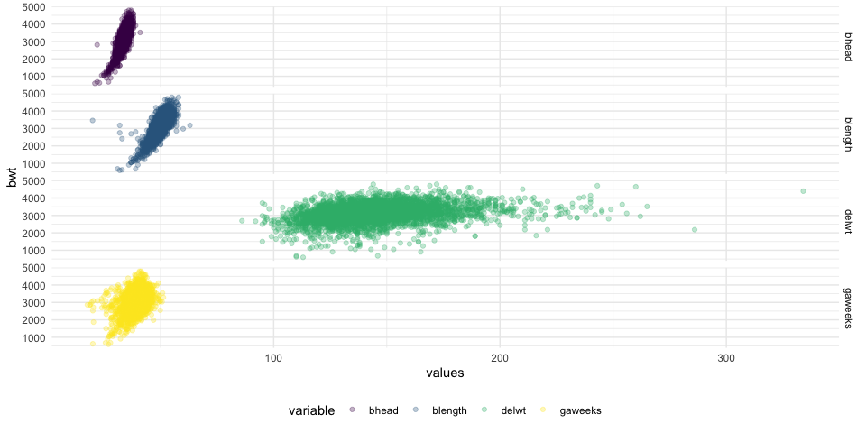

P8105 Data Science I - Homework 6
================
Kevin S.W. UNI: ksw2137
11/21/2019

# Problem 1

First load our birthweight data.

``` r
birthweight_df <- read_csv("./data/Birthweight.csv") %>% 
  janitor::clean_names() %>% 
  mutate_at(.vars = vars("babysex", "malform", # convert columns in vars() to factors
                         "mrace", "frace"
                         ),   
            .funs = funs(factor)) %>% 
  mutate(
    babysex = fct_recode(babysex, male = "1", female = "2"),
    malform = fct_recode(malform, absent = "0", present = "1")
    )

# skimr::skim(birthweight_df)                   # remove "#" to activate skimr check 
```

After loading our birthweight data, we obtain a 4342 by 20 dataset that
all started as numeric variables. `babysex`, `malform`, `frace`, `mrace`
were converted to categorical variables as they should.

Variables are:

  - Baby-related:
      - `bwt`: baby’s birth weight (g)
      - `blength`: baby’s length at birth (cm)
      - `bhead`: baby’s head circumference at birth (cm)
      - `babysex`: baby’s sex (male = 1, female = 2)
      - `gaweeks`: gestational age in weeks
      - `malform`: presence of malformations that could affect weight (0
        = absent, 1 = present)
  - Mom-related:
      - `delwt`: mother’s weight at delivery (lbs)
      - `wtgain`: mother’s weight gain during pregnancy (pounds)
      - `ppwt`: mother’s pre-pregnancy weight (pounds)
      - `ppbmi`: mother’s pre-pregnancy BMI
      - `mheigth`: mother’s height (in.)
      - `momage`: mother’s age at delivery (years)
      - `menarche`: mother’s age at menarche (first menstruation; in
        years)
      - `mrace`: mother’s race (1 = White, 2 = Black, 3 = Asian, 4 =
        Puerto Rican, 8 = Other)
      - `parity`: number of live births prior to this pregnancy
      - `pnumlbw`: previous number of low birth weight babies
      - `pnumsga`: number of prior small-for-gestational-age babies
      - `smoken`: average number of cigarettes smoked per day during
        pregnancy
  - Family/father-related:
      - `frace`: father’s race (1 = White, 2 = Black, 3 = Asian, 4 =
        Puerto Rican, 8 = Other, 9 = Unknown)
      - `fincome`: family monthly income (in hundreds, rounded)

`skimr::skim()` reveals no missing variables. However, it reveals some
variables that likely shouldn’t even be considered; `pnumlbw` and
`pnumsga`, though measures numbers of babies, only records `0` in this
dataset.

### Model Proposal

We will attempt to make a model with `bwt` as our outcome of interest.
Given that there are a lot of variables related to each other, there are
likely a lot of correlations. We can then use a correlation matrix to
see which variables are highly correlated and we can pick one out of
those groups.

``` r
select_if(birthweight_df, is.numeric) %>%     # select numeric variables
  cor() %>%                                   # get the correlation values
  corrplot()                                  # make the correlation matrix
```


Based on the plot above, we see that variables most correlated to `bwt`
is `bhead`, `blength`, `delwt`, `gaweeks`, `wtgain`, `mheight`, and
`ppwt`. However, we also note that `delwt` is highly correlated with
`ppwt`. Given that `delwt` is more correlated to `bwt`, we’ll keep
`delwt` and drop `ppwt`. It is also slightly correlated to `wtgain`, so
we’ll drop `wtgain` to prevent collinearity.

``` r
first_fit <- birthweight_df %>% 
  lm(bwt ~ bhead + blength + delwt + gaweeks, data = .)

first_fit %>% 
  broom::glance() %>% 
  knitr::kable()
```

| r.squared | adj.r.squared |   sigma | statistic | p.value | df |     logLik |      AIC |      BIC |  deviance | df.residual |
| --------: | ------------: | ------: | --------: | ------: | -: | ---------: | -------: | -------: | --------: | ----------: |
| 0.6954304 |     0.6951495 | 282.777 |  2475.692 |       0 |  5 | \-30667.64 | 61347.27 | 61385.53 | 346798796 |        4337 |

``` r
first_fit %>% 
  broom::tidy() %>% 
  knitr::kable()
```

| term        |      estimate |  std.error |   statistic | p.value |
| :---------- | ------------: | ---------: | ----------: | ------: |
| (Intercept) | \-6249.526492 | 95.3679459 | \-65.530682 |       0 |
| bhead       |    135.815296 |  3.5021062 |   38.781033 |       0 |
| blength     |     79.145148 |  2.0739313 |   38.161895 |       0 |
| delwt       |      2.040243 |  0.1994743 |   10.228100 |       0 |
| gaweeks     |     14.181183 |  1.4916192 |    9.507241 |       0 |

``` r
birthweight_df %>% 
  select(bwt, bhead, blength, delwt, gaweeks) %>% 
  pivot_longer(bhead:gaweeks,
               names_to = "variable",
               values_to = "values") %>% 
  ggplot(aes(x = values, y = bwt, color = variable)) +
  geom_point(alpha = 0.3) +
  facet_grid(variable ~ .)
```



Propose a regression model for birthweight. This model may be based on a
hypothesized structure for the factors that underly birthweight, on a
data-driven model-building process, or a combination of the two.
Describe your modeling process and show a plot of model residuals
against fitted values – use add\_predictions and add\_residuals in
making this plot.

Compare your model to two others:

  - Model 1: length at birth, gestational age as predictors (main
    effects only)

<!-- end list -->

``` r
birthweight_df %>% 
  ggplot(aes(x = wtgain, y = bwt, color = menarche)) +
  geom_point(alpha = 0.3) +
  geom_smooth(method = "lm")
```


``` r
model1 <- birthweight_df %>% 
  lm(bwt ~ blength + gaweeks, data = .)

summary(model1)
```

    ## 
    ## Call:
    ## lm(formula = bwt ~ blength + gaweeks, data = .)
    ## 
    ## Residuals:
    ##     Min      1Q  Median      3Q     Max 
    ## -1709.6  -215.4   -11.4   208.2  4188.8 
    ## 
    ## Coefficients:
    ##              Estimate Std. Error t value Pr(>|t|)    
    ## (Intercept) -4347.667     97.958  -44.38   <2e-16 ***
    ## blength       128.556      1.990   64.60   <2e-16 ***
    ## gaweeks        27.047      1.718   15.74   <2e-16 ***
    ## ---
    ## Signif. codes:  0 '***' 0.001 '**' 0.01 '*' 0.05 '.' 0.1 ' ' 1
    ## 
    ## Residual standard error: 333.2 on 4339 degrees of freedom
    ## Multiple R-squared:  0.5769, Adjusted R-squared:  0.5767 
    ## F-statistic:  2958 on 2 and 4339 DF,  p-value: < 2.2e-16

  - Model 2: head circumference, length, sex, and all interactions
    (including the three-way interaction) between these

<!-- end list -->

``` r
model2 <- birthweight_df %>% 
  lm(bwt ~ bhead * blength * babysex, data = .)

summary(model2)
```

    ## 
    ## Call:
    ## lm(formula = bwt ~ bhead * blength * babysex, data = .)
    ## 
    ## Residuals:
    ##      Min       1Q   Median       3Q      Max 
    ## -1132.99  -190.42   -10.33   178.63  2617.96 
    ## 
    ## Coefficients:
    ##                               Estimate Std. Error t value Pr(>|t|)    
    ## (Intercept)                 -7176.8170  1264.8397  -5.674 1.49e-08 ***
    ## bhead                         181.7956    38.0542   4.777 1.84e-06 ***
    ## blength                       102.1269    26.2118   3.896 9.92e-05 ***
    ## babysexfemale                6374.8684  1677.7669   3.800 0.000147 ***
    ## bhead:blength                  -0.5536     0.7802  -0.710 0.478012    
    ## bhead:babysexfemale          -198.3932    51.0917  -3.883 0.000105 ***
    ## blength:babysexfemale        -123.7729    35.1185  -3.524 0.000429 ***
    ## bhead:blength:babysexfemale     3.8781     1.0566   3.670 0.000245 ***
    ## ---
    ## Signif. codes:  0 '***' 0.001 '**' 0.01 '*' 0.05 '.' 0.1 ' ' 1
    ## 
    ## Residual standard error: 287.7 on 4334 degrees of freedom
    ## Multiple R-squared:  0.6849, Adjusted R-squared:  0.6844 
    ## F-statistic:  1346 on 7 and 4334 DF,  p-value: < 2.2e-16

Make this comparison in terms of the cross-validated prediction error;
use crossv\_mc and functions in purrr as appropriate.

Note that although we expect your model to be reasonable, model building
itself is not a main idea of the course and we don’t necessarily expect
your model to be “optimal”

# Problem 2 - Weather Data

In this problem we’ll be using weather data for Central Park, NY in
2017. Code adopted from homework website.

``` r
# loads weather data; code from homework website.
weather_df <- 
  rnoaa::meteo_pull_monitors(
    c("USW00094728"),
    var = c("PRCP", "TMIN", "TMAX"), 
    date_min = "2017-01-01",
    date_max = "2017-12-31") %>%
  mutate(
    name = recode(id, USW00094728 = "CentralPark_NY"),
    tmin = tmin / 10,
    tmax = tmax / 10) %>%
  select(name, id, everything())
```

After loading the data, we should clean it up a bit and only select the
things we need before running a bootstrap and obtaining the r̂-squared
for each resampling as well as
log(beta0\*beta1).

``` r
# selects relevant columns and renames Central Park to cp_ny for simplicity
clean_weather_df <- weather_df %>% 
  select(name, tmax, tmin) %>% 
  mutate(
    name = str_replace(name, "CentralPark_NY", "cp_ny")
  )

# runs bootstrap x5000
bootstrap_runs <- clean_weather_df %>% 
  bootstrap(n = 5) %>% 
  mutate(
    model = map(strap, ~lm(tmax ~ tmin, data = .x)),      # obtains model for each strap sample
    result = map(model, broom::tidy),                     # obtains estimate data from each model
    stat = map(model, broom::glance)                      # obtains statistics from each model
  )

# a cleaned and filtered df containing variables of interest
clean_strap <- bootstrap_runs %>% 
  select(-model, -strap) %>%                              # removed the original strap sample and model
  rename("strap_run" = .id) %>%                           # renamed id to "run numbers"
  unnest() %>%                                            # unnest the tibbles that remained
  select(strap_run, term, estimate, adj.r.squared) %>%    # selected relevant measures
  mutate(
    term = case_when(term == "(Intercept)" ~ "beta0",     # renamed intercept to beta0
                     term == "tmin" ~ "beta1",            # renamed slope to beta1
                     TRUE ~ as.character(term))
  ) %>% 
  pivot_wider(names_from = term,                          # put the betas into different columns
              values_from = estimate) %>% 
  mutate(
    estimate_log = log(beta0 * beta1)                     # add column for the ln(b0 * b1)
  ) %>% 
  janitor::clean_names()
```

After cleaning and bootstrapping, we isolated only the variables we’re
interested in, which is stored in `clean_strap` that contains 5
observations for `adj_r_squared`, `beta0`, `beta1`, and `estimate_log`
labeled by `strap_run`. We can check their distribution using a simple
density plot below.

``` r
# density plot of r-squared with 2.5% and 97.5% quantile labeled
r_squared_plot <- clean_strap %>% 
  ggplot(aes(x = adj_r_squared)) +
  geom_density(color = "seagreen2", fill = "seagreen2", alpha = 0.3) +
  geom_vline(xintercept = c(quantile(pull(clean_strap, adj_r_squared), probs = 0.025),
                            quantile(pull(clean_strap, adj_r_squared), probs = 0.975)),
             linetype = "dashed",
             color = "red") +
  labs(x = "Adjusted R-squared",
       y = "Frequency",
       caption = "Distribution of adjusted R-squared (left) and ln(β̂1 * β̂) (right)")

# density plot of ln(beta0 * beta1) with 2.5% and 97.5% quantile labeled
estimate_log_plot <- clean_strap %>% 
  ggplot(aes(x = estimate_log)) +
  geom_density(color = "steelblue1", fill = "steelblue1", alpha = 0.3) +
  geom_vline(xintercept = c(quantile(pull(clean_strap, estimate_log), probs = 0.025),
                            quantile(pull(clean_strap, estimate_log), probs = 0.975)),
             linetype = "dashed",
             color = "red") +
  labs(x = "ln(β̂1 * β̂0)",
       y = "Frequency")

# use patchwork to print them side-by-side
r_squared_plot + estimate_log_plot
```


Plot suggests that both the r-squared and log(beta0 \* beta1) are
normally distributed. However, note that there is a very slight left
skew on the distribution of r-squared, which shouldn’t greatly deviate
from our assumptions of normality. The red, dashed line represents our
2.5% and 97.5% quantile which are obtained using the `quantile()`
function below.

``` r
# r-sq 95% CI
quantile(pull(clean_strap, adj_r_squared), probs = c(0.025, 0.975))
```

    ##      2.5%     97.5% 
    ## 0.8963538 0.9254344

``` r
# est_log 95% CI
quantile(pull(clean_strap, estimate_log), probs = c(0.025, 0.975))
```

    ##     2.5%    97.5% 
    ## 1.971702 2.051739

As such, we have a 95% CI of \[0.893, 0.927\] for adjusted R-squared and
\[1.966, 2.058\] for ln(β̂1 \* β̂0).
